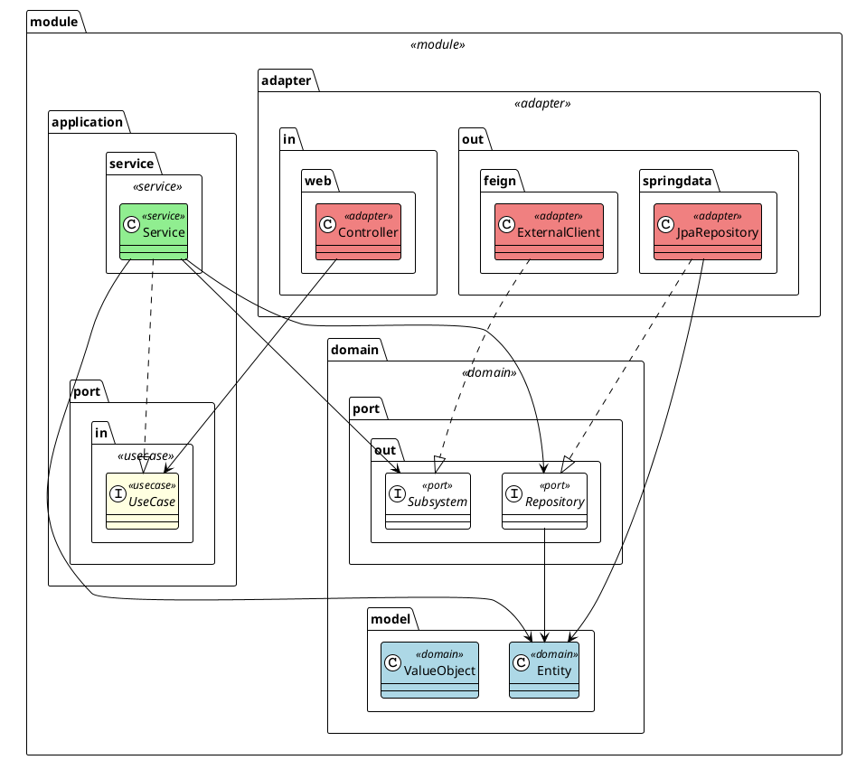
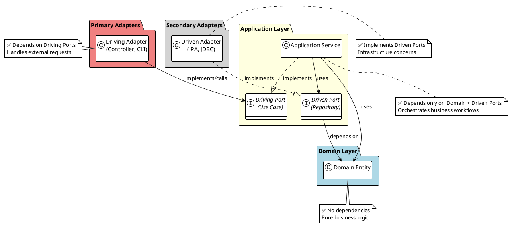

# Hexagonal Architecture Module Organization

This document shows the essential structure and organization of hexagonal architecture modules.

## 📐 Hexagonal Architecture - Module Organization

## 🎯 Dependency Rules

---

**Key Principles:**
- **🔵 Domain** (blue) - No external dependencies, pure business logic
- **🟡 Application** (yellow) - Depends only on domain, orchestrates use cases  
- **🔴 Adapters** (coral) - Depends on application ports, handles infrastructure

**Dependency Direction:** Always points inward → Domain is protected from external changes