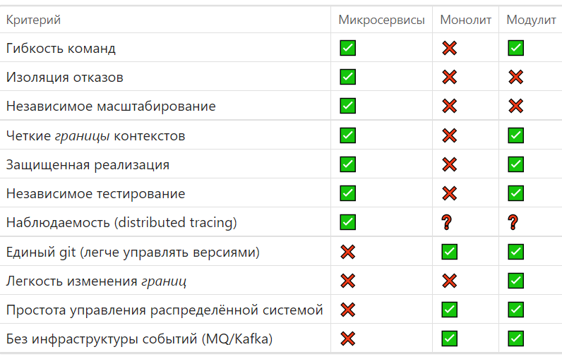

# Spring Modulith 1.3

## Модульная архитектура в Spring приложениях

---

## Что такое Spring Modulith?

- **Framework** для построения модульных монолитных приложений
- Помогает структурировать код по **бизнес-доменам**
- Обеспечивает **изоляцию модулей** и контроль зависимостей
- Поддерживает эволюцию архитектуры от монолита к микросервисам

> "Хорошая архитектура ищет равновесие: разделение только там, где сила дезинтеграции превышает силу интеграции"

---

## Ключевые возможности

1. **Модули (Modules)** — логическая структуризация кода
2. **Верификация (Verification)** — автоматическая проверка границ
3. **Named Interfaces** — явное определение API модулей
4. **События (Events)** — слабосвязанное взаимодействие

---

## Сравнение подходов


<!-- | Критерий | Микросервисы | Монолит | Модулит |
|----------|--------------|---------|---------|
| Гибкость команд | ✅ | ❌ | ✅ |
| Изоляция отказов | ✅ | ❌ | ❌ |
| Независимое масштабирование | ✅ | ❌ | ❌ |
| Четкие *границы* контекстов | ✅ | ❌ | ✅ |
| Защищенная реализация | ✅ | ❌ | ✅ |
| Независимое тестирование | ✅ | ❌ | ✅ |
| Наблюдаемость (distributed tracing) | ✅ | ❓ | ❓ |
| Единый git (легче управлять версиями) | ❌ | ✅ | ✅ |
| Легкость изменения *границ* | ❌ | ❌ | ✅ |
| Простота управления распределённой системой | ❌ | ✅ | ✅ |
| Без инфраструктуры событий | ❌ | ✅ | ✅ |
-->

---
## 1. Модули (Modules)

### Структура модуля

```
application
├── order/              ← Модуль (ApplicationModule)
│   ├── Order.java      ← Public API
│   ├── OrderService.java
│   └── internal/       ← Внутренние детали
│       └── OrderRepository.java
└── inventory/          ← Другой модуль
```

---
### Структура модуля (2)


---

## Определение модуля

### package-info.java

```java
@org.springframework.modulith.ApplicationModule
package com.example.order;
```

**Правила доступа:**
- Классы в **корневом пакете** — публичный API
- Классы во **вложенных пакетах** — приватные
- Другие модули не могут обращаться к `internal`

---

## Вложенные модули

```
order/
├── Order.java
├── fulfillment/        ← Вложенный модуль
│   └── package-info.java  (@ApplicationModule)
└── payment/            ← Вложенный модуль
    └── package-info.java  (@ApplicationModule)
```

**Преимущества:**
- Дополнительная изоляция внутри модуля
- Ограничение доступа даже от родительского модуля

---

## Вложенные модули (2)


---

## 2. Верификация (Verification)

### Автоматическое тестирование архитектуры

```java
@Modulithtest
class ModularityTests {
    
    @Test
    void verifyModularStructure(ApplicationModules modules) {
        modules.verify(); // Проверка всех правил
    }
}
```

---

## Что проверяется?

- Нет циклических зависимостей между модулями (это о *пакетах*)
- Модули обращаются только к публичному API
- Нет доступа к `internal` пакетам
- Соблюдение `allowedDependencies`


---

## IntelliJ IDEA 2025.2

**Встроенная поддержка Spring Modulith:**
- Подсветка нарушений архитектуры
- Навигация по модулям

---

## Стратегии обнаружения модулей

### Для постепенного внедрения:

```yaml
spring:
  modulith:
    detection-strategy: explicitly-annotated
```

**Альтернатива:** Своя реализация `ApplicationModuleDetectionStrategy`
- Игнорирование legacy-пакетов
- Не требует изменений в production коде

---

## 3. Named Interfaces

### Явное определение API модуля

```java
// order/api/package-info.java
@org.springframework.modulith.NamedInterface("api")
package com.example.order.api;

// order/spi/package-info.java
@org.springframework.modulith.NamedInterface("spi")
package com.example.order.spi;
```
- API - интерфейсы для взаимодействия с модулем
    - интерфейсы реализуются в модуле
- SPI - интерфейсы через которые модуль взаимодействует с "внешним миром"
    - интерфейсы реализуются во внешних компонентах

---

## Ограничение зависимостей

```java
@ApplicationModule(
    allowedDependencies = "order :: spi"
)
package com.example.inventory;
```

**Результат:**
- `inventory` может использовать только `order.spi`
- Доступ к `order.api` будет заблокирован
- `allowedDependencies = {}` — whitelist (ничего не разрешено)

---

## In/Out модуля


- **Provided Interface (API)** — что модуль предоставляет
- **Required Interface (SPI)** — что модуль требует от других

---

## 4. События (Events)

### Асинхронное взаимодействие между модулями

**Преимущества:**
- Слабая связанность (loose coupling)
- Независимое развитие модулей
- Естественная эволюция к микросервисам

---

## Типы обработчиков событий

### @EventListener
```java
@EventListener
void handle(OrderPlaced event) { }
```
- **Синхронная** обработка в том же потоке
- Exception откатит транзакцию отправителя

---

### @Async + @EventListener
```java
@Async
@EventListener
void handle(OrderPlaced event) { }
```
- **Асинхронная** обработка в другом потоке
- Exception не влияет на отправителя

---

### @TransactionalEventListener
```java
@Async
@TransactionalEventListener(phase = TransactionPhase.AFTER_COMMIT)
void handle(OrderPlaced event) { }
```
- Асинхронная обработка
- Отправка в зависимости от **фазы транзакции** (параметр `phase`)
- **Фазы:** `AFTER_COMMIT` (по умолчанию), `BEFORE_COMMIT`, `AFTER_ROLLBACK`, `AFTER_COMPLETION` (как в AOP)


---

### @ApplicationModuleListener

```java
@ApplicationModuleListener
void handle(OrderPlaced event) { }
```

**Объединяет:**
- `@Async`
- `@Transactional(REQUIRES_NEW)`
- `@TransactionalEventListener`

**Результат:** Всё как у `TransactionalEventListener` + обработка в отдельной транзакции.

---

## Гарантированная доставка событий

**Механизм Event Publication Registry:**

1. **Перед публикацией** события сохраняются в БД
2. Публикация события в Spring Context
3. **После успешной обработки** запись удаляется
4. При сбое запись остается в БД

**Таблица:** `event_publication`
- `id`, `event_type`, `serialized_event`, `publication_date`, `completion_date`

Spring Modulith автоматически отслеживает необработанные события

---

## Повторная отправка событий

```java
@Scheduled(fixedDelay = 60000)
public void resubmitFailedEvents() {
    incompleteEvents.resubmitIncompletePublications(
        it -> it.olderThan(Duration.ofMinutes(1))
    );
}
```

Автоматическое переотправление не обработанных событий

---

## Замена прямых вызовов на события

**До:**
```java
inventoryService.reserveItems(order);  // Прямая зависимость
```

**После:**
```java
eventPublisher.publishEvent(new OrderPlaced(order));
```

**Условие:** Методы возвращают `void`

---

## Где использовать события?

- **Событие** != Команда
- Событие это уведомление об изменении состояния чего либо
- Используйте вызовы публичных интерфейсов, если нужно получить ответ

---

## Силы интеграции vs дезинтеграции

### Когда выделять модуль в микросервис?

| Фактор | За разделение (+) | За объединение (−) |
|--------|-------------------|-------------------|
| Частота изменений | Разная | Одинаковая |
| Команды | Отдельные | Общая |
| Данные | Изолированные | Общие таблицы |
| Масштабирование | Разные профили | Одинаковое |
| Отказоустойчивость | Изоляция важна | Не критична |

---

## Матрица оценки

```
Сумма баллов:
  > +3   → выделить в микросервис
  −3..+3 → оставить как модуль
  < −3   → объединить
```

**Пример:**
- Разные частоты изменений: +3
- Общие данные: −2
- Изоляция отказов: +2
- **Итого: +3** → граница неопределённа, оставить модулем

---

## Практические рекомендации

- Структурируйте код по **фичам** или **бизнес-доменам**
- Скрывайте реализацию через package-private компоненты
- Используйте **автоматическую верификацию**
- Применяйте **события** для развязывания модулей
- Оценивайте **силы интеграции/дезинтеграции**

---

## Модули как самодостаточные элементы с адаптерами


---

## Модули как самодостаточные элементы с адаптерами (2)


---

## Полезные ссылки

- https://docs.spring.io/spring-modulith/reference/1.3/index.html

---

## Заключение

**Spring Modulith 1.3** — это:
- ✅ Структурированная архитектура
- ✅ Автоматический контроль качества
- ✅ Гибкость эволюции системы
- ✅ Баланс между монолитом и микросервисами

### Начните с модулей, а не с микросервисов!

---

# Спасибо за внимание!

## Вопросы?
